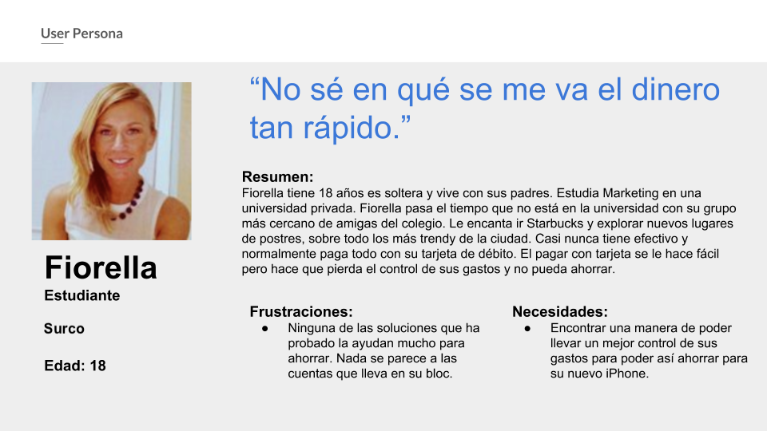
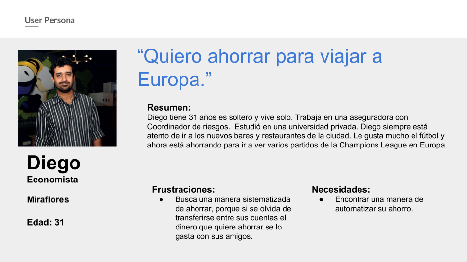
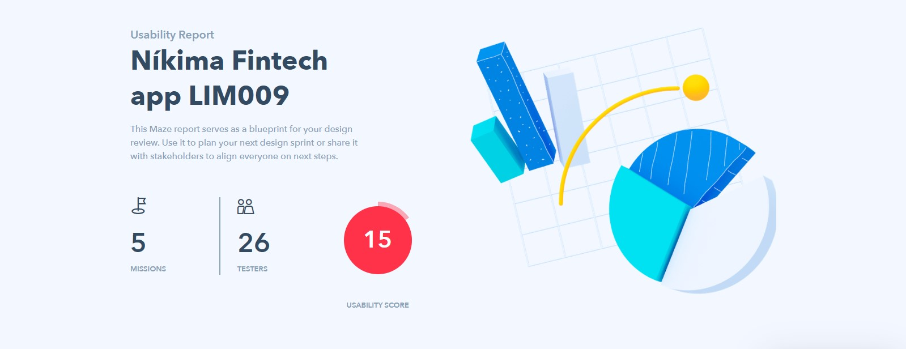
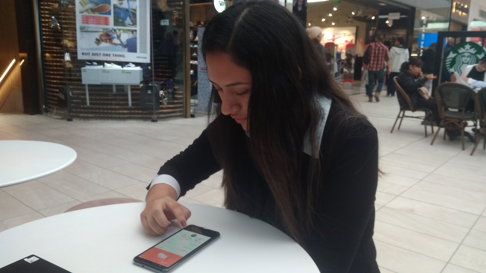
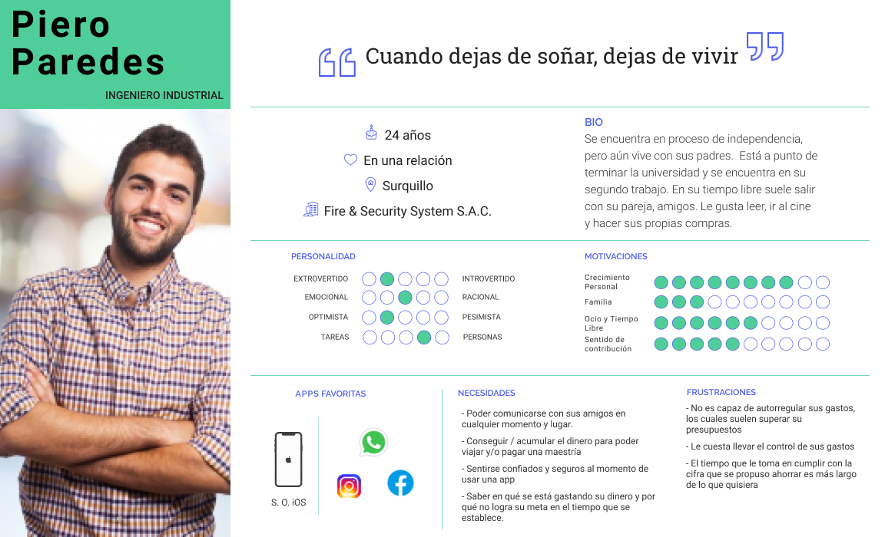
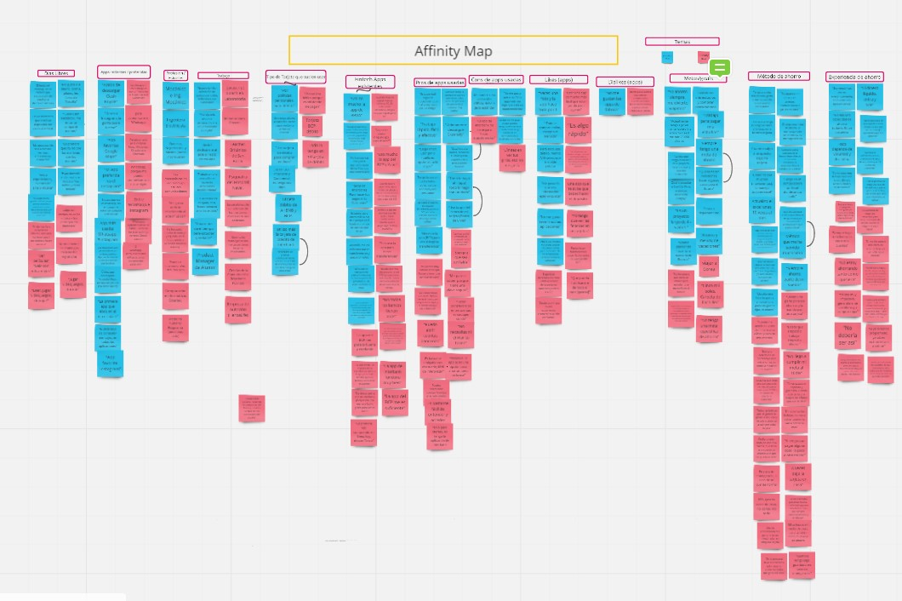

# Fintech App: **Tus Finanzas**

## OBJETIVOS INICIALES DEL PROYECTO
*	Validar la investigación previamente hecha. 
* Testear la versión actual de Tus Finanzas.
*	Traducir la data. 
*	Presentar mejoras a la solución actual en base a las conclusiones de los anteriores. 

## PROBLEMAS ENCONTRADOS
### A NIVEL DE USUARIO
Los perfiles que nos dio el cliente eran dos. La primera, Fiorella, recién ha cumplido la mayoría de edad y está muy familiarizada con la dependencia tecnológica.  Por otro lado, el segundo, Diego, es profesional e independiente, y está relacionado con la tecnología solo lo suficiente. En común tenemos que ambos vienen de una clase social media para arriba, son curiosos y sociables, y les gustaría ahorrar, pero no tienen el control sobre sus gastos.
Con el propósito de validar estos perfiles, hicimos 5 entrevistas a personas de 18 a 23 años, y otras 5 entrevistas a personas de 29 a 34 años. Estas entrevistas nos arrojaron perfiles con nuevas y adicionales características: el perfil de usuario más joven era inexperta en áreas financieras, y no tiene metas claras de ahorro, ya que el ahorro no es su mayor preocupación; adicionalmente, el segundo perfil es una persona instruida, con ansias de cubrir sus necesidades de autorrealización, por lo tanto tiene metas bien definidas y con ellas, una voluntad disciplinada para ver cumplidos sus objetivos. 

Paralelamente, se testeó virtual y presencialmente el prototipo de alta fidelidad, donde la herramienta de testeo virtual, Maze, nos arrojaba data de las áreas de mejora y el testeo presencial nos indicaba de forma más específica los puntos donde el usuario podía no tener una buena experiencia en la aplicación. Estos hallazgos se verían reflejados luego en la herramienta de análisis mental del cliente llamado Customer Jouney Map. 

 

**Entonces**, se evidenció que los user persona planteados por el cliente no eran objetivos con la app, por lo tanto se procedió a entrevistar a personas entre 24 a 26 años (edades intermedias entre los user persona anteriores) para encontrar el equilibrio que necesitábamos: en camino a formar sus hábitos de ahorro y familiarizado con la tecnología. Y así fue. 
Nuestro nuevo perfil de usuario se llamaría **Piero Paredes**. Se apoya en la tecnología para sus actividades cotidianas para lograr ser totalmente responsable en sus metas. Está terminando sus estudios y trabaja con el objetivo de pronto independizarse y vivir con su novia. Está lleno de sueños y además, con toda la voluntad del mundo para lograrlos. 

Este perfil se pudo determinar gracias al Affinity Map construido en Miro, una pizarra online para el trabajo en colaborativo, donde no solo nació la información básica de Piero Paredes, sino también su personalidad, sus intereses, sus necesidades y frustraciones.

En esto descubrimos que Piero quiere ahorrar, pero primero debe tener bajo control sus egresos; y para que la app cumpla con sus objetivos de ahorro, debe, entonces, cubrir la necesidad de Piero en cuanto al control de gastos para que él pueda empezar a ahorrar. Por añadidura, la relación entre la app y el usuario debe aparentar ser más fuerte a comparación del banco con la app, en orden de generar confianza a Piero y así, su fidelidad. 

